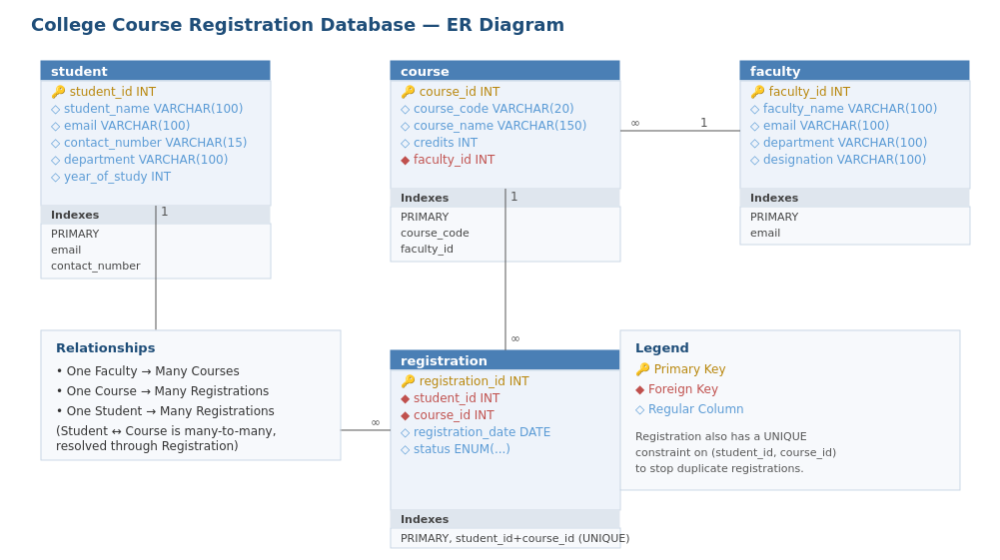

# 🎓 College Course Registration System — Backend API

A RESTful backend for managing a college's course registration process — students, faculty, courses, and the many-to-many relationship between students and the courses they register for.

Built with **Node.js**, **Express**, and **MySQL**, with a properly normalized relational schema and a full CRUD + reporting API.

---

## 📌 Problem Statement

Colleges often manage student, faculty, and course data manually, making it difficult to track enrollments, generate course-wise reports, or maintain accurate relationships between students and the courses they take. This project solves that with a relational database and a clean REST API on top of it.

---

## 🏗️ Entity Relationship Diagram



- **One Faculty → Many Courses**
- **One Course → Many Registrations**
- **One Student → Many Registrations**
- **Student ↔ Course is many-to-many**, resolved through the `Registration` junction table

---

## 🛠️ Tech Stack

| Layer | Technology |
|---|---|
| Runtime | Node.js |
| Framework | Express.js |
| Database | MySQL |
| DB Driver | mysql2 (promise-based) |
| Dev Tooling | nodemon, dotenv, cors |

---

## ✨ Features

- Full CRUD for Students, Faculty, and Courses
- Student course registration with duplicate-registration protection (`UNIQUE(student_id, course_id)`)
- Registration status lifecycle: `Registered → Completed / Dropped`
- Relational reporting endpoints:
  - Student–Course relationship (INNER JOIN)
  - Course-wise student list
  - Per-student registered courses
  - Aggregate stats: total registrations, students per department, students per course, faculty teaching load
- Referential integrity via foreign keys with `ON DELETE CASCADE`
- Centralized error handling and consistent JSON response shape

---

## 📂 Project Structure

```
college-course-registration/
├── config/
│   └── db.js                      # MySQL connection pool
├── controllers/
│   ├── student.controller.js
│   ├── faculty.controller.js
│   ├── course.controller.js
│   └── registration.controller.js # includes JOIN-based reporting logic
├── routes/
│   ├── student.routes.js
│   ├── faculty.routes.js
│   ├── course.routes.js
│   └── registration.routes.js
├── middleware/
│   └── notFound.js
├── docs/
│   └── er-diagram.png
├── database/
│   └── schema.sql                 # full DB schema + sample data
├── .env.example
├── .gitignore
├── package.json
└── server.js
```

---

## 🚀 Getting Started

### 1. Clone the repository
```bash
git clone https://github.com/<your-username>/college-course-registration.git
cd college-course-registration
```

### 2. Install dependencies
```bash
npm install
```

### 3. Set up the database
Open MySQL Workbench (or the CLI) and run the schema file:
```bash
mysql -u root -p < database/schema.sql
```
This creates the `college_course_db` database, all 4 tables, and sample data.

### 4. Configure environment variables
```bash
cp .env.example .env
```
Then edit `.env` with your own MySQL credentials.

### 5. Run the server
```bash
npm run dev
```
The API will be running at `http://localhost:5000`.

---

## 📡 API Reference

### Students — `/api/students`
| Method | Endpoint | Description |
|---|---|---|
| GET | `/` | Get all students |
| GET | `/:id` | Get a single student |
| POST | `/` | Create a student |
| PUT | `/:id` | Update a student |
| DELETE | `/:id` | Delete a student |

### Faculty — `/api/faculty`
| Method | Endpoint | Description |
|---|---|---|
| GET | `/` | Get all faculty |
| GET | `/:id` | Get a single faculty member |
| POST | `/` | Create a faculty member |
| PUT | `/:id` | Update a faculty member |
| DELETE | `/:id` | Delete a faculty member |

### Courses — `/api/courses`
| Method | Endpoint | Description |
|---|---|---|
| GET | `/` | Get all courses |
| GET | `/:id` | Get a single course |
| POST | `/` | Create a course |
| PUT | `/:id` | Update a course |
| DELETE | `/:id` | Delete a course |

### Registrations — `/api/registrations`
| Method | Endpoint | Description |
|---|---|---|
| GET | `/` | Get all registrations |
| POST | `/` | Register a student for a course |
| PUT | `/:id/status` | Update registration status |
| DELETE | `/:id` | Delete a registration |
| GET | `/report/student-course` | Student–Course relationship (JOIN) |
| GET | `/report/course-wise` | Course-wise student list |
| GET | `/report/stats` | Aggregate stats (department, course, faculty load) |
| GET | `/student/:studentId` | All courses a student is registered for |

**Example request:**
```bash
curl -X POST http://localhost:5000/api/registrations \
  -H "Content-Type: application/json" \
  -d '{"student_id": 1, "course_id": 3, "registration_date": "2026-09-18"}'
```

**Example response:**
```json
{
  "success": true,
  "message": "Registration created successfully",
  "data": { "registration_id": 9, "student_id": 1, "course_id": 3, "registration_date": "2026-09-18" }
}
```

---

## 🗄️ Database Design

| Table | Purpose |
|---|---|
| `Student` | Student personal and academic information |
| `Faculty` | Faculty details and designation |
| `Course` | Course details, linked to the faculty teaching it |
| `Registration` | Junction table resolving the Student ↔ Course many-to-many relationship |

Full schema with constraints, foreign keys, and sample data is in [`database/schema.sql`](./database/schema.sql).

---

## 🔮 Future Enhancements

- [ ] Student login and authentication (JWT)
- [ ] Prerequisite checking before registration
- [ ] Seat limit and waitlist management per course
- [ ] Automated email notifications on registration
- [ ] Grade and attendance tracking
- [ ] Faculty timetable clash detection
- [ ] React frontend for a full-stack experience

---

## 👩‍💻 Author

**Vindhya Lakshmi V**
B.Sc. Computer Science — Government Arts and Science College, Gudalur
Built as part of TN Skill Development training, in association with AdroIT Technologies & Oracle.

---

## 📄 License

This project is licensed under the MIT License.
